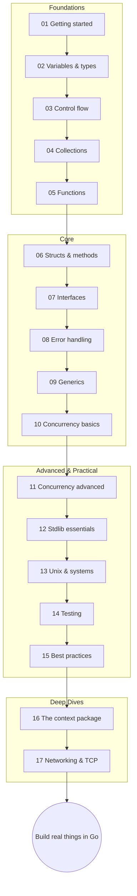

# Go: From Basics to Advanced — a hands-on tutorial

A 17-module, example-driven tour of Go (Golang), from your first `go run` to
production-grade patterns. Every concept comes with small, heavily-commented,
runnable programs — you learn by running and tweaking real code, not by
reading alone.

## How to use this series

1. **Read the modules in order** — each folder has a `README.md` that explains
   the concepts and links them to the example files.
2. **Run every example.** Each `.go` file is a standalone program:

   ```bash
   cd module01_getting_started
   go run 01_hello.go
   ```

   (Exception: `module14_testing` uses `go test ./...` instead — test files
   can't be run with `go run`; its README explains.)
3. **Tweak and re-run.** Change a value, break something on purpose, predict
   the output before running. That's where the learning happens.
4. **Do the exercises** at the end of each README — 2–3 small tasks that use
   exactly what the module taught.

## Prerequisites

- **Go 1.22 or newer** installed ([go.dev/dl](https://go.dev/dl)) — check with
  `go version`.
- A terminal and any editor (VS Code + the Go extension is a great default).
- Basic programming experience in *some* language helps but isn't required —
  Foundations starts from zero.

## The modules

### Foundations (01–05)

| Module | What it covers |
|--------|----------------|
| [module01_getting_started](module01_getting_started/) | Installing Go, `go run`/`go build`, modules, your first programs |
| [module02_variables_types_constants](module02_variables_types_constants/) | Variables, basic types, zero values, constants and iota |
| [module03_control_flow](module03_control_flow/) | `if`, `for` (Go's only loop), `switch`, `defer` |
| [module04_collections](module04_collections/) | Arrays, slices and their internals, maps, strings vs runes |
| [module05_functions](module05_functions/) | Functions, multiple returns, variadics, closures, recursion |

### Core (06–10)

| Module | What it covers |
|--------|----------------|
| [module06_structs_methods](module06_structs_methods/) | Structs, methods, pointer vs value receivers, embedding |
| [module07_interfaces](module07_interfaces/) | Implicit interfaces, small-interface design, type assertions/switches |
| [module08_error_handling](module08_error_handling/) | Errors as values, wrapping with `%w`, `errors.Is/As`, panic/recover |
| [module09_generics](module09_generics/) | Type parameters, constraints, when generics help (and when not) |
| [module10_concurrency_basics](module10_concurrency_basics/) | Goroutines, channels, `select`, `sync.WaitGroup` |

### Advanced & Practical (11–15)

| Module | What it covers |
|--------|----------------|
| [module11_concurrency_advanced](module11_concurrency_advanced/) | Race detector, mutexes/atomics, `context`, worker pools, pipelines, channel axioms |
| [module12_stdlib_essentials](module12_stdlib_essentials/) | Guided tour: `fmt`, `strings`, `time`, `io`, JSON, `net/http`, `slices`, `slog`, `flag` |
| [module13_unix_systems](module13_unix_systems/) | Files & permissions, paths, `os/exec`, signals & graceful shutdown, pipe-friendly CLIs, a mini grep |
| [module14_testing](module14_testing/) | `go test`, table-driven tests, benchmarks, fuzzing, coverage, `httptest`, fakes |
| [module15_best_practices](module15_best_practices/) | Idiomatic style, project layout, tooling, performance, pitfalls checklist, production readiness |

### Deep Dives (16–17)

| Module | What it covers |
|--------|----------------|
| [module16_context](module16_context/) | The `context` package in depth: cancellation trees, timeouts/deadlines, values, `WithCancelCause`/`AfterFunc`, leaks and idioms |
| [module17_networking_tcp](module17_networking_tcp/) | The `net` package: TCP servers method-by-method (`Listen`/`Accept`/`Conn`), deadlines, framing, dialers, DNS helpers |

## Learning path



Comfortable with another language already? You can skim 01–03 quickly, but
don't skip **04 (slices!)**, **07 (interfaces)**, or **08 (errors)** — they're
where Go differs most from what you know.

Happy hacking — and remember: the fastest way to learn Go is to break the
examples and fix them again.
